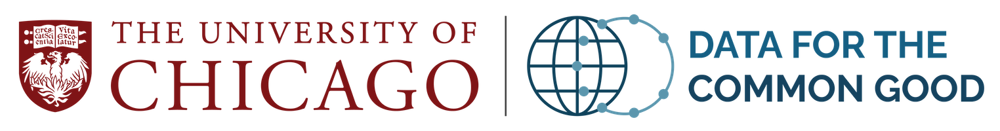
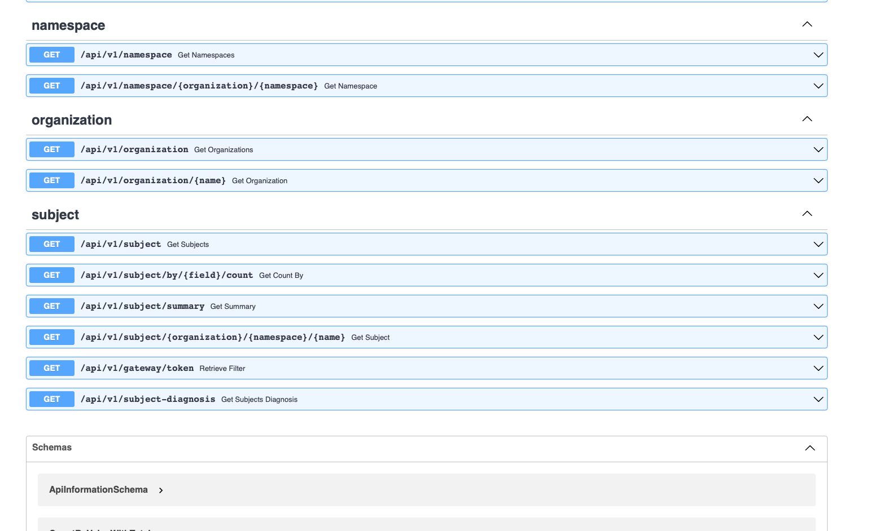

# Welcome to pedscommons.org! 

**Welcome to pedscommons.org, home of Data for the Commmon Good (D4CG).**

The [Pediatric Cancer Data Commons](http://commons.cri.uchicago.edu/pcdc) is the flagship project of [Data for the Common Good (D4CG)](https://commons.cri.uchicago.edu), an international leader in data harmonization and democratization. Headquartered at the University of Chicago, we work with groups around the world to expand access to pediatric cancer data for oncologists and researchers.

The [PCDC Data Portal](https://portal.pedscommons.org/login) is a unified home for clinical data on pediatric cancers, available to all researchers. Use our cohort explorer and other analytic tools to explore the available data and assess study feasibility. Line-level data may be requested through our project application process.

[GEARBOx](https://gearbox.pedscommons.org/), developed by D4CG in partnership with The Leukemia & Lymphoma Society, is a decision-support tool for use by clinicians and nurse navigators to identify potential clinical trials to enroll their patients, based on the patient’s clinical and genomic testing and on information abstracted from the trial protocol. 

**Join us in working toward a world where access to high-quality data is never a barrier to curing diseases and improving human health.** Use the links on this page to access the [PCDC Data Portal](https://portal.pedscommons.org/login) and [GEARBOx](https://gearbox.pedscommons.org/), find [documentation and help with our tools](https://docs.pedscommons.org/), and [learn more about D4CG at our website](http://commons.cri.uchicago.edu).

|[{ align=left }](https://commons.cri.uchicago.edu "Our Website") D4CG Website|[{ align=left }](https://docs.pedscommons.org "Our Documentation") **D4CG Documentation**|
|:---:|:---:|
|[{ align=left }](https://portal.pedscommons.org "Our Data Common") **PCDC Data Portal**|[{ align=left }](https://gearbox.pedscommons.org "Our Clinical Trial Tool") **GEARBOx**|
|:---:|:---:|
|[{ align=left }](https://ccdifederation.pedscommons.org/api/v1/docs "Our federation server") **CCDI Federation**||

Questions?  Contact us at <pcdc_help@lists.uchicago.edu>
